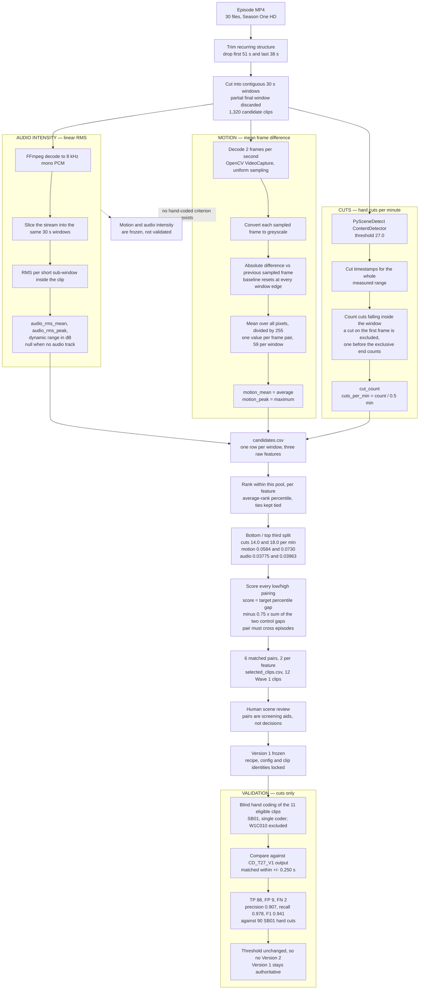

# Feature extraction and clip selection — flowchart

**Study:** Adult Perceptions of Pacing in Children’s Television  
**Legacy frozen recipe identifier:** `Adult Prediction of Children's Perceived Media Pacing - Feature
Extraction` v1 (`0d233950c561`), measurement fingerprint `a5714394da4d`
**Corpus:** Curious George Full Season One HD, 30 episodes → 1,320 candidate
windows → 6 matched pairs → 12 Wave 1 clips
**Written:** 2026-08-23

This diagram is descriptive: it records how the three matching features were
actually produced for Version 1. Authority for the procedure itself stays with
`STUDY_CLIP_SELECTION.md`, `STUDY_CALIBRATION_PLAN.md` and
`STUDY_WAVE1_SINGLE_CODER_ANALYSIS_PLAN_method-manual-vs-automated_recipe-v1_2026-08-23_correction-04.md`.

Nothing here is a composite. All three recipe weights are zero by design, so
cuts, motion and audio intensity stay separate matching dimensions and no
sensory-load score is calculated or interpreted.

## What the diagram is claiming, and what it is not

**Cuts** is the only feature with a human comparison behind it. The F1 of 0.941
shown above is this study's own single-coder calibration at ±0.250 s on 11
clips — it is not CMAT's headline figure, which is a transition-**boundary**
F1 of 0.85 (range 0.75–0.91), matched type-agnostically within ±2 s, from a
preliminary single-coder pilot on the first ~5 minutes of two episodes. The two
numbers answer different questions on different material and must not be merged
or quoted interchangeably.

**Motion** is a deterministic signal measurement with no detection step: mean
absolute greyscale frame difference at 2 fps. It cannot separate object motion
from camera motion from a cut, and its value depends on the sampling rate,
which is why the rate is frozen. No hand-coded motion criterion exists in this
project, so it has been graded against nothing.

**Audio intensity** is linear RMS, not perceptual loudness — not LUFS, not
EBU R128. Ungraded in the same sense as motion.

**The selection is relative.** "Low" and "high" mean bottom and top third *of
these 1,320 windows*, not of children's television. The thresholds are printed
in the diagram so the comparison set is always visible.

**The CUTS_2 low member changed on 2026-08-23.** This diagram describes how the
Version 1 pool and pairs were produced, which is unchanged. But the clip filling
the CUTS_2 low slot was replaced under correction-06 because the original
contained the inter-story title card; the pair is now 8 vs 26 cuts/min rather
than 4 vs 26. The selection rule shown here is the rule that chose the
replacement too.

**The exported files were re-measured on 2026-08-23.** Motion and audio are
essentially unchanged by the transcode. Four clips lose one near-start cut each
— a boundary effect, since a standalone clip has no frame before its own first
frame — which means MOTION_1 and AUDIO_2 no longer have exactly equal cut rates
between their members on the files participants would watch.

**These are naturally occurring clips.** Nothing was manipulated, so the design
supports associational claims only. Final exported stimuli must be re-measured,
because transcoding can move the values.
